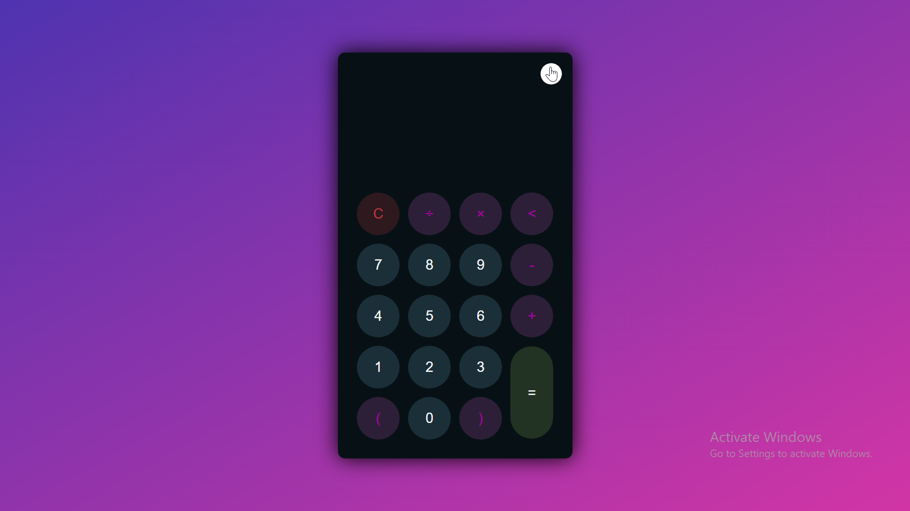

 

  <h1>🧮 Calculator</h1>
  
A simple, stylish, and functional calculator with <b>Light</b> & <b>Dark</b> themes built using HTML, CSS, and JavaScript.

  
  <!-- Light Theme Screenshot -->
  
    
  <!-- Dark Theme Screenshot -->
  

---

## About The Project

The **Calculator Project** is a web-based calculator that performs basic arithmetic operations with an additional **Light/Dark Theme Toggle** for a better user experience.  

This project is a great practice for learning **JavaScript DOM manipulation, event handling, theme toggling, and responsive design**.

### Built With

- HTML5  
- CSS3  
- JavaScript  

### Features

- Clean and modern user interface  
- **Light & Dark theme toggle** 🌗  
- Responsive layout for desktop and mobile  
- Supports basic arithmetic operations (+, −, ×, ÷)  
- Interactive button clicks and hover effects  
- Error handling for invalid inputs  

---

## Contact

**Muhammad Salman Arshad**  
🔗 [LinkedIn](https://www.linkedin.com/in/muhammad-salmanarshad/)  
📧 [msalmanwebdev@gmail.com](mailto:msalmanwebdev@gmail.com)

(<a href="#top">Back to Top</a>)

